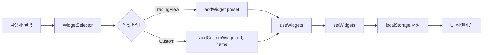

# 실시간 금융 대시보드 - 아키텍처 분석 📊

## 📌 프로젝트 개요

**프로젝트명**: Real-time Financial Dashboard (Gold-Stock-Coin-Live)  
**기술 스택**: React 18 + Vite 5 + Tailwind CSS + shadcn/ui  
**목적**: 금/주식/암호화폐/환율 데이터를 실시간으로 모니터링하고 AI 채팅 기능을 제공하는 통합 대시보드

---

## 🏗️ 1. 전체 아키텍처

### 1.1 계층 구조 (Layered Architecture)

```
┌─────────────────────────────────────────────────────┐
│  Presentation Layer (UI Components)                 │
│  - React Components, shadcn/ui, Tailwind CSS        │
├─────────────────────────────────────────────────────┤
│  Application Layer (Business Logic)                 │
│  - Custom Hooks, State Management                   │
├─────────────────────────────────────────────────────┤
│  Integration Layer (External Services)              │
│  - TradingView Widgets, Google Gemini, News API     │
├─────────────────────────────────────────────────────┤
│  Extension Layer (Chrome Extension)                 │
│  - X-Frame-Options Bypass, Security Headers         │
└─────────────────────────────────────────────────────┘
```

### 1.2 모듈 구조

```
gold-stock-coin-live/
├── public/                    # 정적 파일 + Chrome Extension
│   ├── manifest.json         # Extension 설정
│   ├── background.js         # Service Worker
│   └── rules.json            # declarativeNetRequest 규칙
├── src/
│   ├── main.jsx              # 앱 진입점
│   ├── App.jsx               # 글로벌 Provider 설정
│   ├── pages/                # 페이지 컴포넌트
│   │   ├── Index.jsx         # 대시보드 메인
│   │   ├── Settings.jsx      # 설정
│   │   └── NotFound.jsx      # 404
│   ├── components/           # UI 컴포넌트
│   │   ├── Layout.jsx        # 전체 레이아웃
│   │   ├── Sidebar.jsx       # 내비게이션
│   │   ├── TradingViewWidget.jsx  # 차트 위젯
│   │   ├── WebsiteWidget.jsx      # iframe 위젯
│   │   ├── WidgetSelector.jsx     # 위젯 선택기
│   │   ├── panels/           # 사이드 패널
│   │   │   ├── ChatPanel.jsx     # Gemini AI 채팅
│   │   │   ├── NewsPanel.jsx     # 뉴스 검색
│   │   │   └── MemoPanel.jsx     # 메모
│   │   └── ui/               # shadcn/ui 컴포넌트 (49개)
│   ├── hooks/                # 커스텀 훅
│   │   ├── useWidgets.js     # 위젯 상태 관리
│   │   ├── usePerplexity.js  # API 통합
│   │   └── use-toast.js      # 알림 시스템
│   ├── lib/                  # 유틸리티
│   │   ├── newsApi.js        # 뉴스 API
│   │   └── utils.js          # 공통 함수
│   └── config/               # 설정 파일
└── index.html                # HTML 진입점
```

---

## ⚙️ 2. 핵심 아키텍처 패턴

### 2.1 컴포넌트 기반 아키텍처 (Component-Based Architecture)

**특징**:
- React의 컴포넌트 재사용성 극대화
- shadcn/ui의 49개 UI 컴포넌트 활용
- 관심사 분리 (Separation of Concerns)

**계층 구조**:
```
App (Root)
  └── Layout (메인 레이아웃)
      ├── Sidebar (고정 내비게이션, 80px)
      ├── Panel (슬라이딩 패널, 300-800px)
      │   ├── ChatPanel
      │   ├── NewsPanel
      │   ├── MemoPanel
      │   └── Settings
      └── Main (대시보드)
          └── Index
              ├── WidgetSelector
              └── Widgets[]
                  ├── TradingViewWidget
                  └── WebsiteWidget
```

### 2.2 상태 관리 패턴 (State Management)

**1) Local State (useState)**
- 컴포넌트별 독립 상태 관리
- 예: `isPanelOpen`, `panelWidth`, `activeTab`

**2) Persistent State (localStorage)**
- 위젯 목록 영구 저장
- 사용자 설정 보존
- 키: `"financial-dashboard-widgets"`

**3) Server State (TanStack Query)**
- 비동기 데이터 캐싱
- 자동 리페칭
- 에러 처리

### 2.3 이벤트 기반 아키텍처 (Event-Driven)

**패턴**: Props Drilling → Callback Functions

```jsx
// 예시: 위젯 제거 플로우
Index → TradingViewWidget → onRemove(widgetId)
   ↓
useWidgets.removeWidget(widgetId)
   ↓
setWidgets(prev => prev.filter(...))
   ↓
localStorage 자동 동기화 (useEffect)
```

---

## 🔄 3. 데이터 플로우 (Data Flow)

### 3.1 위젯 생성 플로우



### 3.2 실시간 데이터 흐름

```
External API → iframe/script → Component → UI
    ↓
 TradingView
 Google Gemini
 News API
```

**구체적 예시**:

1. **TradingView 차트**:
   ```
   TradingViewWidget → window.TradingView.widget({...})
   → s3.tradingview.com/tv.js (CDN)
   → 실시간 차트 렌더링
   ```

2. **Gemini AI 채팅**:
   ```
   ChatPanel → iframe (gemini.google.com)
   → Chrome Extension (X-Frame-Options 우회)
   → AI 채팅 인터페이스
   ```

3. **뉴스 검색**:
   ```
   사용자 입력 → searchNews(query, apiType)
   → Google/Naver API
   → 결과 표시 (accordion + iframe 미리보기)
   ```

### 3.3 패널 상태 전환

```
Dashboard (기본)
   ↓ 사용자 클릭 "News"
News Panel 열림 (isPanelOpen=true, activeTab="news")
   ↓ 다시 클릭
Panel 닫힘 (isPanelOpen=false)
   ↓ Settings 클릭
Settings Panel 열림 (isPanelOpen=true, activeTab="settings")
```

**숨김 렌더링 전략**:
- 모든 패널을 DOM에 유지 (absolute positioning)
- `opacity` + `pointer-events`로 표시/숨김 전환
- **장점**: 상태 보존 (iframe 세션, 입력값 유지)

---

## 🔒 4. 보안 아키텍처

### 4.1 Chrome Extension을 통한 X-Frame-Options 우회

**문제**: Google Gemini는 `X-Frame-Options: DENY` 헤더로 iframe 삽입 차단

**해결책**: Chrome Extension (Manifest V3)

```javascript
// public/manifest.json
{
  "manifest_version": 3,
  "permissions": ["declarativeNetRequest"],
  "host_permissions": ["https://gemini.google.com/*"],
  "declarative_net_request": {
    "rule_resources": [{ "id": "ruleset_1", "path": "rules.json" }]
  }
}

// public/rules.json
{
  "id": 1,
  "action": { "type": "modifyHeaders", 
              "responseHeaders": [
                { "header": "X-Frame-Options", "operation": "remove" },
                { "header": "Content-Security-Policy", "operation": "remove" }
              ]
  }
}
```

**플로우**:
```
1. 사용자가 Chrome에 Extension 설치 (개발자 모드)
2. background.js (Service Worker) 활성화
3. declarativeNetRequest 규칙 적용
4. gemini.google.com 응답 헤더 수정
5. iframe 삽입 성공
6. ChatPanel에서 Extension 상태 확인 (chrome.runtime.sendMessage)
```

### 4.2 입력 검증 (Input Validation)

```javascript
// 1. Zoom 값 검증 (25-200%)
const sanitizedZoom = Math.max(25, Math.min(200, Math.floor(zoom)));

// 2. 숫자 입력만 허용
const numValue = parseInt(value, 10);
if (!isNaN(numValue)) { onZoomChange(widgetId, numValue); }

// 3. localStorage 파싱 에러 처리
try { return JSON.parse(saved); } 
catch { return []; }
```

### 4.3 iframe 샌드박싱

```jsx
<iframe
  sandbox="allow-forms allow-scripts allow-same-origin allow-popups allow-presentation"
  src={url}
/>
```

---

## 🎨 5. UI/UX 아키텍처

### 5.1 레이아웃 시스템

**3단 구조**:

```
┌────┬──────────────┬─────────────────────────┐
│ S  │   Panel      │   Main Dashboard        │
│ I  │   (Sliding)  │   (Dynamic Grid)        │
│ D  │              │                         │
│ E  │   300-800px  │   Flex-1                │
│ B  │              │                         │
│ A  │   Resizable  │   Auto-grid             │
│ R  │              │   min(380px, 1fr)       │
│    │              │                         │
│ 80 │              │                         │
└────┴──────────────┴─────────────────────────┘
```

**반응형 계산**:
```javascript
// Main 영역의 padding-left
isPanelOpen ? `calc(5rem + ${panelWidth}px)` : '5rem'

// 패널 리사이징
const newWidth = e.clientX - 80; // Sidebar 너비 제외
if (newWidth >= 300 && newWidth <= 800) setPanelWidth(newWidth);
```

### 5.2 애니메이션 전략

**1) CSS Transitions**:
```css
transition: all 500ms cubic-bezier(0.32, 0.72, 0, 1);
/* Ease-out 곡선 → 부드러운 감속 */
```

**2) 리사이징 중 전환 비활성화**:
```jsx
className={isResizing ? "duration-0" : "duration-500"}
// 드래그 중에는 즉시 반응, 마우스 업 후 부드럽게 정착
```

**3) 뉴스 아코디언 애니메이션**:
```jsx
<div className={cn(
  "grid transition-all duration-500 ease-in-out",
  isExpanded 
    ? "grid-rows-[1fr] opacity-100 mt-4" 
    : "grid-rows-[0fr] opacity-0"
)}>
```

### 5.3 디자인 시스템

**색상 카테고리**:
```javascript
{
  crypto: "border-crypto/30 shadow-crypto/10",
  stock:  "border-stock/30 shadow-stock/10",
  gold:   "border-gold/30 shadow-gold/10",
  forex:  "border-primary/30 shadow-primary/10"
}
```

**Tailwind 커스터마이징** (tailwind.config.js):
- 커스텀 색상 정의 (crypto, stock, gold)
- 애니메이션 확장 (fade-in, slide-in)
- 타이포그래피 플러그인

---

## 🧩 6. 핵심 기능 모듈

### 6.1 위젯 시스템 (useWidgets Hook)

**역할**: 동적 위젯 생성/제거/관리

```javascript
const useWidgets = () => {
  const [widgets, setWidgets] = useState(() => {
    // localStorage에서 불러오기
    const saved = localStorage.getItem(STORAGE_KEY);
    return saved ? JSON.parse(saved) : [];
  });

  // 자동 저장
  useEffect(() => {
    localStorage.setItem(STORAGE_KEY, JSON.stringify(widgets));
  }, [widgets]);

  return {
    widgets,              // 위젯 배열
    addWidget,            // 프리셋 추가
    removeWidget,         // 위젯 삭제
    addCustomWidget,      // 커스텀 URL 추가
    updateWidgetZoom,     // 확대/축소
    toggleFullscreen      // 전체화면 토글
  };
};
```

**위젯 데이터 구조**:
```javascript
{
  widgetId: "gold-1701234567890",  // 고유 ID
  id: "gold",                      // 프리셋 ID
  name: "금 시세",
  symbol: "TVC:GOLD",              // TradingView 심볼
  category: "gold",
  icon: "TrendingUp",
  type: "tradingview",
  zoom: 100,
  scriptConfig: {...}
}
```

### 6.2 TradingView 통합

**동적 스크립트 로딩**:
```javascript
useEffect(() => {
  const script = document.createElement("script");
  script.src = "https://s3.tradingview.com/tv.js";
  script.async = true;
  
  script.onload = () => {
    if (window.TradingView) {
      new window.TradingView.widget({
        autosize: true,
        symbol: symbol,
        interval: "D",
        timezone: "Asia/Seoul",
        theme: "light",
        locale: "ko",
        container_id: `tradingview_${widgetId}`,
        ...scriptConfig
      });
    }
  };
  
  document.body.appendChild(script);
  
  return () => {
    if (script.parentNode) {
      script.parentNode.removeChild(script);
    }
  };
}, [widgetId, symbol, scriptConfig]);
```

### 6.3 뉴스 검색 모듈

**API 추상화** (lib/newsApi.js):
```javascript
export const searchNews = async (query, apiType = 'google') => {
  if (apiType === 'google') {
    // Google Custom Search API 호출
    const response = await fetch(
      `https://www.googleapis.com/customsearch/v1?key=${API_KEY}&cx=${CX}&q=${query}`
    );
    // 결과 정규화
    return items.map(item => ({
      id: item.cacheId || generateId(),
      title: item.title,
      snippet: item.snippet,
      url: item.link,
      source: extractSource(item.link),
      date: item.pagemap?.metatags?.[0]?.['article:published_time']
    }));
  } else if (apiType === 'naver') {
    // Naver API 로직
  }
};
```

**accordion + iframe 프리뷰**:
- 축소 상태: 제목 + 요약
- 확장 상태: 600px iframe + 원문 미리보기
- 에러 처리: X-Frame-Options 차단 시 "새 탭에서 열기" 버튼

---

## 🚀 7. 애플리케이션 라이프사이클

### 7.1 초기화 플로우

```
1. index.html 로드
   ↓
2. main.jsx 실행 → createRoot()
   ↓
3. App.jsx 렌더링
   - QueryClientProvider 초기화
   - TooltipProvider 설정
   - BrowserRouter 시작
   ↓
4. Layout.jsx 마운트
   - Sidebar 렌더링
   - Panel 준비 (숨김 상태)
   - Main 영역 활성화
   ↓
5. Index.jsx (Dashboard) 로드
   - useWidgets Hook 초기화
   - localStorage에서 위젯 복원
   - 각 위젯 렌더링
   ↓
6. TradingView 스크립트 동적 로딩
   - CDN에서 tv.js 다운로드
   - 각 위젯별 chart 초기화
   ↓
7. ChatPanel Extension 체크
   - chrome.runtime.sendMessage()
   - Extension 활성화 여부 확인
   - 상태 표시 업데이트
```

### 7.2 런타임 플로우

**사용자 시나리오 1: 위젯 추가**
```
사용자 "위젯 추가" 버튼 클릭
  → WidgetSelector Dialog 열림
  → 프리셋 선택 (예: Bitcoin)
  → addWidget({ id: 'btc', symbol: 'BINANCE:BTCUSDT', ... })
  → setWidgets([...prev, newWidget])
  → useEffect 트리거 → localStorage 저장
  → 리렌더링 → TradingViewWidget 컴포넌트 생성
  → useEffect → TradingView 스크립트 로드
  → 차트 표시
```

**사용자 시나리오 2: 뉴스 검색**
```
사용자 "News" 클릭
  → setActiveTab("news") + setIsPanelOpen(true)
  → Panel 슬라이드 인 (300ms 애니메이션)
  → NewsPanel opacity: 0 → 1
  → 검색어 입력 "테슬라 주가"
  → handleSearch → searchNews("테슬라 주가", "google")
  → API 요청 → 결과 10개
  → 카드 렌더링
  → 카드 클릭 → iframe 확장 (grid-rows 애니메이션)
  → 웹사이트 미리보기 표시
```

**사용자 시나리오 3: Gemini 채팅**
```
사용자 "Chat" 클릭
  → ChatPanel 활성화
  → useEffect → Extension 체크
  → chrome.runtime.sendMessage({ type: 'checkExtension' })
  → Extension 있음: "활성" 표시
  → iframe src="https://gemini.google.com/app"
  → Extension의 declarativeNetRequest 작동
  → X-Frame-Options 헤더 제거
  → iframe 로드 성공
  → Gemini 인터페이스 표시
```

---

## 📊 8. 성능 최적화 전략

### 8.1 컴포넌트 최적화

**1) React.memo**:
```javascript
export const TradingViewWidget = memo(({ widgetId, name, ... }) => {
  // props 변경 시에만 리렌더링
});

const Index = memo(() => {
  // 부모 리렌더링 시 무효한 리렌더링 방지
});
```

**2) 조건부 렌더링**:
```javascript
// 전체화면 모드 시 해당 위젯만 표시
const displayWidgets = fullscreenWidgetId
  ? widgets.filter(w => w.widgetId === fullscreenWidgetId)
  : widgets;
```

### 8.2 상태 보존 vs 언마운트

**패널 숨김 렌더링**:
```jsx
<div className={activeTab === 'chat' 
  ? "opacity-100 z-10" 
  : "opacity-0 -z-10 pointer-events-none"
}>
  <ChatPanel /> {/* 항상 DOM에 유지 */}
</div>
```

**장점**:
- iframe 세션 유지 (Gemini 로그인)
- 입력 상태 보존 (뉴스 검색어, 메모)
- 탭 전환 속도 향상

**단점**:
- 초기 메모리 사용량 증가

### 8.3 스크립트 정리

```javascript
return () => {
  // TradingView 스크립트 제거
  if (script.parentNode) {
    script.parentNode.removeChild(script);
  }
};
```

**목적**: 메모리 누수 방지, 위젯 제거 시 정리

---

## 🔍 9. 에러 처리 및 복원력

### 9.1 네트워크 에러

```javascript
try {
  const news = await searchNews(trimmed, apiType);
  setResults(news);
  if (news.length === 0) {
    setError('검색 결과가 없습니다.');
  }
} catch (err) {
  setError(err?.message || '뉴스를 불러오지 못했습니다.');
}
```

### 9.2 iframe 로딩 실패

```jsx
const [iframeError, setIframeError] = useState(false);

<iframe 
  onError={handleIframeError}
  onLoad={handleIframeLoad}
/>

{iframeError && (
  <Alert>
    <AlertTitle>Gemini 연결 실패</AlertTitle>
    <AlertDescription>
      Chrome 확장 프로그램을 설치하세요...
    </AlertDescription>
  </Alert>
)}
```

### 9.3 localStorage 복원

```javascript
const [widgets, setWidgets] = useState(() => {
  const saved = localStorage.getItem(STORAGE_KEY);
  if (saved) {
    try {
      return JSON.parse(saved);
    } catch {
      console.error('Failed to parse widgets from localStorage');
      return [];
    }
  }
  return [];
});
```

---

## 🎯 10. 아키텍처 장점 및 설계 원칙

### 10.1 SOLID 원칙 적용

**1) Single Responsibility (단일 책임)**
- `useWidgets`: 위젯 상태 관리만
- `TradingViewWidget`: 차트 렌더링만
- `newsApi`: API 호출 및 데이터 정규화만

**2) Open/Closed (개방-폐쇄)**
- 새로운 위젯 타입 추가 용이
- `scriptConfig` props로 TradingView 설정 확장 가능

**3) Dependency Inversion (의존성 역전)**
- 컴포넌트는 추상화된 Hook을 의존
- `Index → useWidgets` (구체적 구현 분리)

### 10.2 확장성

**1) 위젯 시스템**:
- 프리셋 기반 설계 → 새 금융 상품 추가 간단
- `widgetId` 기반 관리 → 동일 심볼 여러 개 추가 가능

**2) API 통합**:
- `newsApi.js`에서 API 타입별 분기
- 새 뉴스 소스 추가 시 `searchNews` 함수만 수정

**3) 패널 시스템**:
- `Layout.jsx`에서 패널 추가 시 조건부 렌더링만 추가
- 각 패널은 독립적으로 개발 가능

### 10.3 유지보수성

**1) 컴포넌트 분리**:
- UI (components) / Logic (hooks) / API (lib) 명확히 구분
- 각 파일이 200줄 이하로 관리

**2) 타입 안정성** (ESLint):
- React Hooks 규칙 강제
- Props 검증

**3) 스타일 일관성**:
- Tailwind CSS로 중앙화된 디자인 토큰
- shadcn/ui로 통일된 컴포넌트 스타일

---

## 📈 11. 발전 가능성

### 11.1 기술적 개선점

**1) TypeScript 마이그레이션**
- 현재: JavaScript (JSX)
- 개선: TypeScript로 전환 → 타입 안정성 강화

**2) 상태 관리 라이브러리**
- 현재: React Context + localStorage
- 개선: Zustand/Jotai → 전역 상태 관리 개선

**3) 백엔드 통합**
- 현재: 클라이언트 사이드만
- 개선: Supabase 완전 통합 → 멀티 디바이스 동기화

### 11.2 기능 확장

**1) 실시간 알림**
- WebSocket 연결 → 가격 알림
- Service Worker → 푸시 알림

**2) 포트폴리오 관리**
- 보유 자산 입력
- 수익률 계산 및 시각화

**3) AI 분석 강화**
- Gemini API 직접 통합
- 차트 분석 자동화

---

## 🏆 12. 결론

### 핵심 아키텍처 특징

1. **모듈화된 컴포넌트 구조**: 재사용성과 유지보수성 극대화
2. **동적 위젯 시스템**: 사용자 맞춤형 대시보드 구성
3. **Chrome Extension 통합**: 보안 정책 우회로 iframe 삽입 구현
4. **반응형 레이아웃**: 리사이징 가능한 3단 구조
5. **상태 보존 전략**: 숨김 렌더링으로 UX 향상
6. **외부 API 통합**: TradingView, Gemini, News API 통합

### 기술 스택 선택 이유

- **React**: 컴포넌트 기반 아키텍처, 풍부한 생태계
- **Vite**: 빠른 개발 서버, HMR 지원
- **Tailwind CSS**: 유틸리티 우선, 빠른 스타일링
- **shadcn/ui**: 접근성, 커스터마이징 가능한 컴포넌트
- **Chrome Extension**: X-Frame-Options 우회 유일한 해결책

### 학습 포인트

✅ **프론트엔드 아키텍처 설계**  
✅ **외부 API 통합 및 에러 처리**  
✅ **Chrome Extension 개발 (Manifest V3)**  
✅ **React Hooks 기반 상태 관리**  
✅ **반응형 UI/UX 구현**  
✅ **성능 최적화 (memo, 조건부 렌더링)**  

---

**작성일**: 2025-12-06  
**프로젝트 버전**: 0.0.0  
**분석 목적**: 학교 발표용 아키텍처 문서
